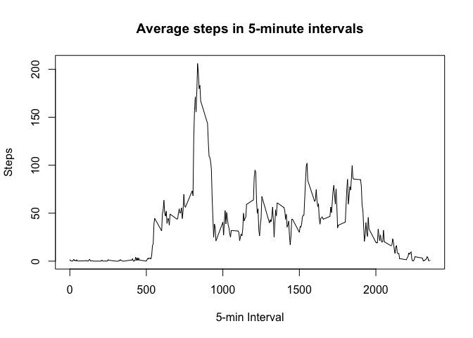
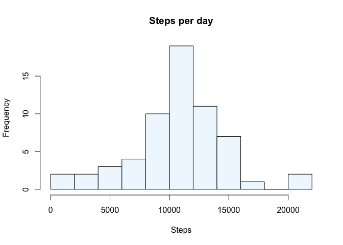
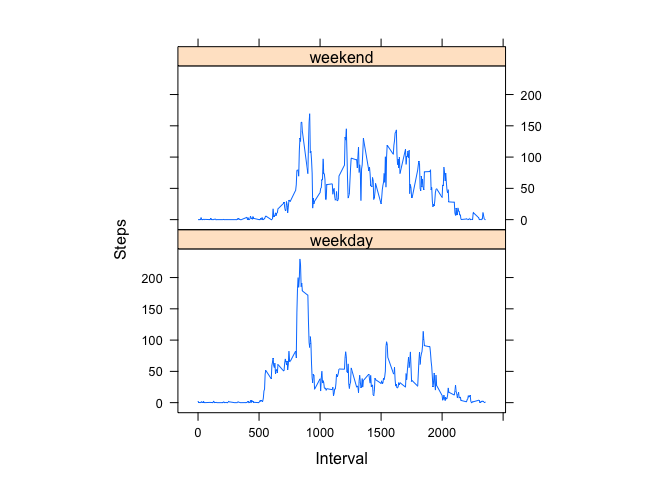

# Reproducible Research: Peer Assessment 1


## Loading and preprocessing the data
1. Load activity data

```r
data <- read.csv(unz("activity.zip", "activity.csv"))
str(data)
```

```
## 'data.frame':	17568 obs. of  3 variables:
##  $ steps   : int  NA NA NA NA NA NA NA NA NA NA ...
##  $ date    : Factor w/ 61 levels "2012-10-01","2012-10-02",..: 1 1 1 1 1 1 1 1 1 1 ...
##  $ interval: int  0 5 10 15 20 25 30 35 40 45 ...
```

2. Process/transform the data into a format suitable for the analysis

```r
data$date <- as.Date(data$date)
```

## What is mean total number of steps taken per day?
1. Total number of steps taken per day

```r
totalSteps <- aggregate(steps~date, data=data, sum, na.rm=TRUE)
head(totalSteps, 5)
```

```
##         date steps
## 1 2012-10-02   126
## 2 2012-10-03 11352
## 3 2012-10-04 12116
## 4 2012-10-05 13294
## 5 2012-10-06 15420
```

2. Plot the histogram of the total number of steps taken each day

```r
hist(totalSteps$steps, main = "Steps per day", xlab = "Steps", col = "aliceblue", breaks = 15)
```

<!-- -->

3. Calculate the mean and median of the total number of steps taken per day

```r
stepMean <- round(mean(totalSteps$steps), 1)
stepMedian <- median(totalSteps$steps)
```
The mean of total steps is 1.07662\times 10^{4}, and its median is 10765.

## What is the average daily activity pattern?
1. Make a time series plot (i.e. type = "l") of the 5-minute interval (x-axis) and the average number of steps taken, averaged across all days (y-axis)

```r
stepsInterval <- aggregate(steps ~ interval, data = data, mean, na.rm = TRUE)
plot(steps ~ interval, data = stepsInterval, type = "l", main = "Average steps in 5-minute intervals", xlab = "5-min Interval", ylab="Steps")
```

<!-- -->

2. Which 5-minute interval, on average across all the days in the dataset, contains the maximum number of steps?

```r
maxSteps <- stepsInterval[which.max(stepsInterval$steps), ]$interval
```
The maximun number of steps locates at the Nr.835 interval.

## Imputing missing values
1. Calculate and report the total number of missing values in the dataset (i.e. the total number of rows with NAs)

```r
NAs <- sum(is.na(data))
```
There are 2304 missing values in the dataset.

2. Devise a strategy for filling in all of the missing values in the dataset.

```r
library(DMwR2)
data_imputed <- knnImputation(data)
str(data_imputed)
```

```
## 'data.frame':	17568 obs. of  3 variables:
##  $ steps   : num  8.1 1.8 0.7 0.8 0 1.3 2.8 0 0 0 ...
##  $ date    : Date, format: "2012-10-01" "2012-10-01" ...
##  $ interval: int  0 5 10 15 20 25 30 35 40 45 ...
```
The K-Nearest Neighbours(KNN) method is used here to impute the data.

3. Make a histogram of the total number of steps taken each day. Calculate and report the mean and median total number of steps taken per day.

```r
totalStepsNew <- aggregate(steps ~ date, data = data_imputed, sum)
stepMeanNew <- round(mean(totalStepsNew$steps), 1)
stepMedianNew <- median(totalStepsNew$steps)
hist(totalStepsNew$steps, main = "Steps per day", xlab = "Steps", col = "aliceblue", breaks = 15)
```

<!-- -->

The mean of total steps after imputing is 1.06378\times 10^{4}, and its median is 1.06\times 10^{4}. The mean/median difference after imputing are 1.2% and 1.5%, respectively. The differences are small. Therefore, it does not change the distribution of the histogram.

## Are there differences in activity patterns between weekdays and weekends?


```r
library(lubridate); library(lattice)
data_imputed$days <- mapply(wday, data_imputed$date)
data_imputed$days <- ifelse(data_imputed$days %in% c(1,7), "weekend", "weekday")
stepsInterval2 = aggregate(steps ~ interval + days, data_imputed, mean)
xyplot(steps ~ interval | factor(days), data = stepsInterval2, aspect = 1/2, type = "l", xlab="Interval", ylab="Steps")
```

<!-- -->

The main difference between weekday- and weekend- activities is clearly seen for the morning time, where the weekday-activities have a strong peak.
