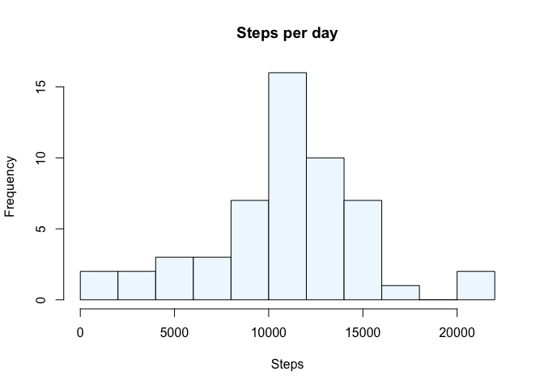

# Reproducible Research: Peer Assessment 1


## Loading and preprocessing the data
1. Load activity data

```r
data <- read.csv(unz("activity.zip", "activity.csv"))
str(data)
```

```
## 'data.frame':	17568 obs. of  3 variables:
##  $ steps   : int  NA NA NA NA NA NA NA NA NA NA ...
##  $ date    : Factor w/ 61 levels "2012-10-01","2012-10-02",..: 1 1 1 1 1 1 1 1 1 1 ...
##  $ interval: int  0 5 10 15 20 25 30 35 40 45 ...
```
2. Process/transform the data into a format suitable for the analysis

```r
data$date <- as.Date(data$date)
```

## What is mean total number of steps taken per day?
1. Total number of steps taken per day

```r
totalSteps <- aggregate(steps~date, data=data, sum, na.rm=TRUE)
head(totalSteps, 5)
```

```
##         date steps
## 1 2012-10-02   126
## 2 2012-10-03 11352
## 3 2012-10-04 12116
## 4 2012-10-05 13294
## 5 2012-10-06 15420
```
2. Plot the histogram of the total number of steps taken each day

```r
hist(totalSteps$steps, main = "Steps per day", xlab = "Steps", col = "aliceblue", breaks = 15)
```

<!-- -->
3. Calculate the mean and median of the total number of steps taken per day

```r
stepMean <- round(mean(totalSteps$steps), 1)
stepMedian <- median(totalSteps$steps)
```
The mean of total steps is 1.07662\times 10^{4}, and its median is 10765.

## What is the average daily activity pattern?


## Imputing missing values


## Are there differences in activity patterns between weekdays and weekends?
